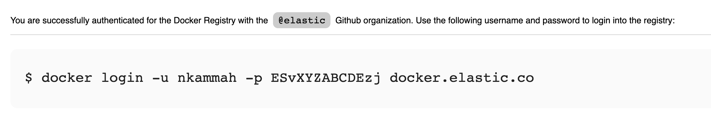
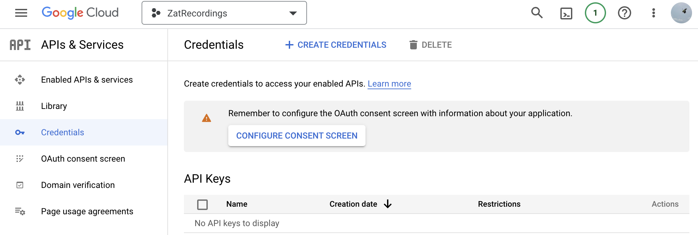
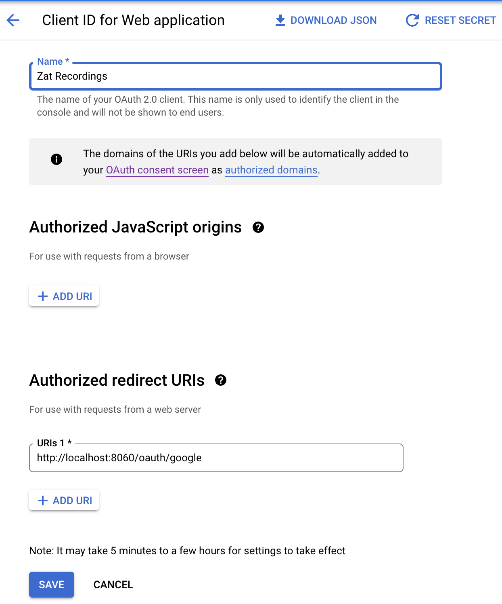
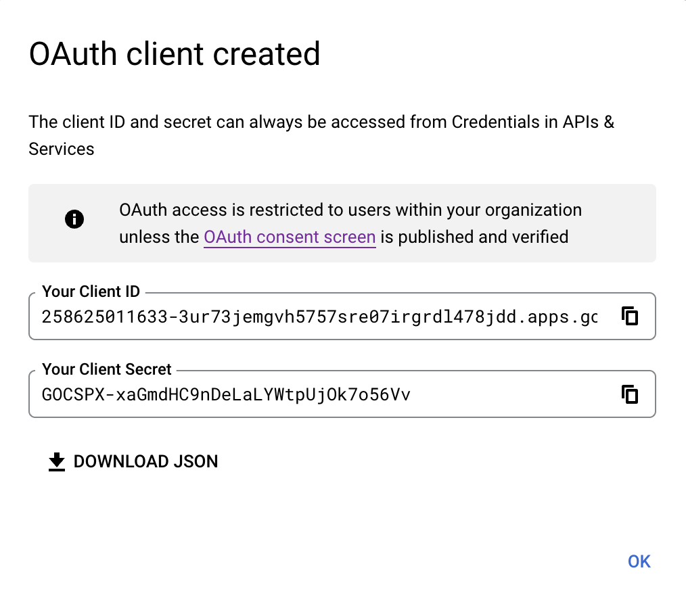
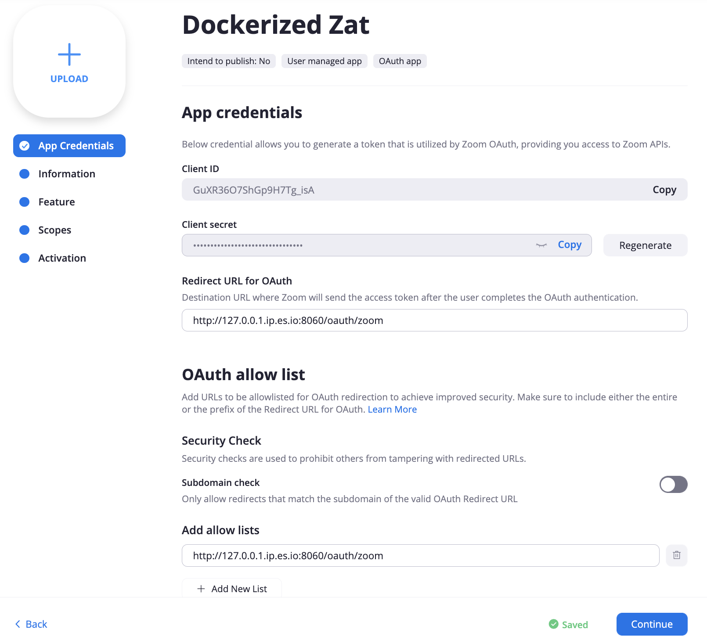
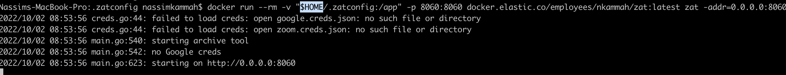
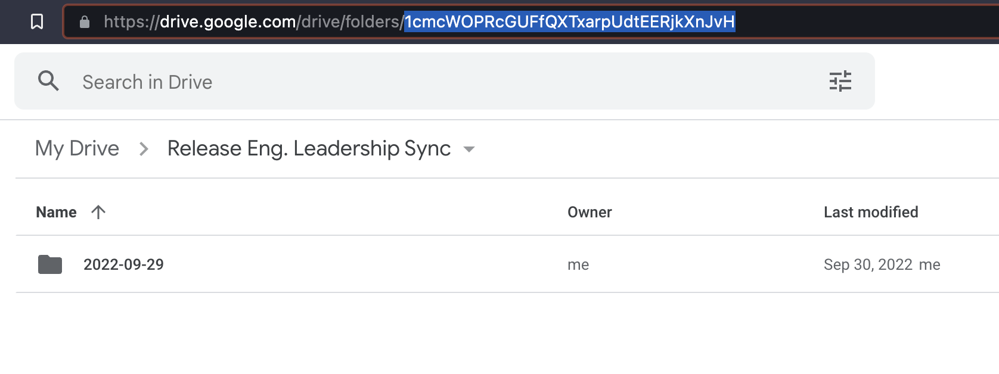
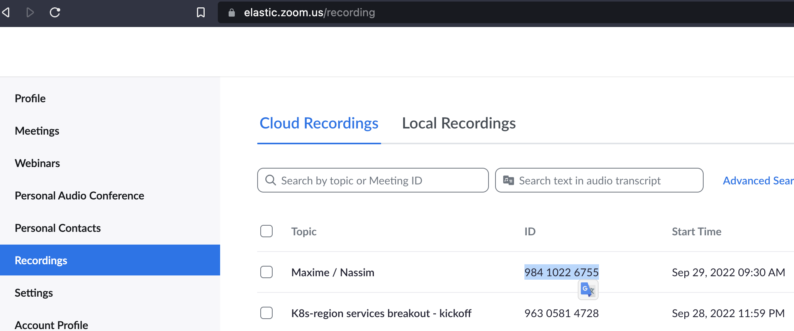

Zat detailed configuration guide
---


## Pre-requisites

We'll be using the Terminal app to run commands.
You can already launch it by hitting the `command+space` keys then searching for `terminal`.

### Install Docker and configure it

1. Download and install [Docker Desktop](https://docs.docker.com/desktop/install/mac-install/) for Mac.
You'll get a warning saying that Docker Desktop needs privileged access - you will need to enter your computer password when prompted.
You'll see a "Docker Subscription Service Agreement" screen - accept it.

2. Start Docker and create an account
Open the Docker app, and follow the steps to create an account.


### Log into Elastic container registry

We're now going to log into Elastic container registry, where we'll download zat.
Visit [https://docker-auth.elastic.co](https://docker-auth.elastic.co) - click on the `Login to @elastic with GitHub` button.
You may get redirect to an Okta log-in screen, but eventually will see a page as below:




Copy the full line, after the `$` sign and paste it into the Terminal window and press enter.
You should see a `Login Succeeded` message.

## Configuring Zat

### Create a configuration folder

We're first going to create a local folder to hold all the configuration files.
Make sure to not share its content as it holds sensitive information.

In the Terminal, type the below command:

```
mkdir $HOME/.zatconfig
cd $HOME/.zatconfig
open .
```
The last command will prompt the `.zaconfig` folder we just created to open in Finder.


### Creating Google credentials


1. Select or create a new Google Project
Visit the [Google console](https://console.cloud.google.com/apis/credentials)

It is very likely you'll need to start by creating a Google project but if you already have one configured, feel free to re-use it.
Otherwise, hit the "New Project" button and enter a project name, such as `ZatRecordings`.
Make sure to select `Elastic` as the parent organization.
Wait a few minutes until the project is created

2. Configure the consent screen if needed

Visit the [API and Services page](https://console.cloud.google.com/apis/credentials).
You may see a warning to Configure Consent Screen - if so, click on the button to configure it.


Select `internal` user type, give it a name similar to the project name, and add your contact email.


3. Create an Oauth Client ID credential

Click the + CREATE CREDENTIALS button at the top of the screen and select "OAuth client ID"
In the Application type drop down menu, pick "Web application"
In the "Authorized redirect URIs" field, enter "http://localhost:8060/oauth/google"



Upon successful creation, you'll get the option to download a JSON file.
Download as `google.config.json` and move it to the zatconfig folder we created at the very beginning.




### Creating Zoom credentials


1. Visit the[ Zoom Marketplace](https://marketplace.zoom.us/develop/create)
You may have to log in to your Elastic Zoom account.
Once you are logged in, go back to the [Create Application page](https://marketplace.zoom.us/develop/create).

2. Click on the Create button for an "OAuth" application.
Give it a name (eg. Zat Recordings) - select `User Managed` and un-select the option to publish the app on the Zoom App Marketplace.
You will then be redirected to a set of configuration screens.

**App Credentials** tab

In the `Redirect URL for OAuth`, enter `http://127.0.0.1.ip.es.io:8060/oauth/zoom`
In the `Add allow lists`, enter `http://127.0.0.1.ip.es.io:8060/oauth/zoom`
Click Continue



**Information** tab
Enter a short description, eg. "Move my zoom recordings to Google drive for me."
Enter a long description, eg. "Move my zoom recordings to Google drive for me."
Scroll to the end, and in the "Developer Contact Information", enter your Name and Elastic email address.

**Feature** tab
No configuration needed

**Scopes** tab
Click on "Add Scope" and select the "Recording > View your recordings" option.
![Zoom App Scope](img/zoom_app_scope.png]

**Activation** tab
Address any errors reported in the activation tab, if any.
Now go back to the App Credentials tab as we'll need to grab some informations from there in the next step.

3. Create the Zoom credentials file

In your terminal, type the below commands:
```
touch $HOME/.zatconfig/zoom.config.json
open $HOME/.zatconfig/zoom.config.json
```

Your default text editor will open an empty file. We're going to store in there the zoom app credentials.
Copy the below text into your file.
```json
     {
       "id":             "your-id",
       "secret":         "your-secret",
       "oauth_redirect": "http://127.0.0.1.ip.es.io:8060/oauth/zoom"
     }
```

Go back to the **App Credentials** tab of your Zoom app.
Click the "Copy" button next to the "Client ID" and paste it in the `your-id` field of the zoom config file.
Click the "Copy" button next to the Client Secret field and paste it in the `your-secret` field of the zoom config file.
Save the file and close it.

### Authenticate to Google and Zoom using Zat

1. In your terminal, type the below command
```
docker run --rm -v "$HOME/.zatconfig:/app" -p 8060:8060 docker.elastic.co/employees/nkammah/zat:latest zat -addr=0.0.0.0:8060
```
You should see the below output:



2. Visit the following URL in your browser: http://0.0.0.0:8060


3. Click on the Google link
Make sure to pick your Elastic google account if you are using multiple accounts
Click the `Allow` button

4. Click on the Zoom link
Click the `Allow` button

5. Go back to the terminal and hit the `control` and `c` keys to stop the program.

### Configure the meetings to move

In your terminal, type the below commands:
```
touch $HOME/.zatconfig/zat.yml
open $HOME/.zatconfig/zat.yml
```

Your default text editor will open an empty file.
We're going to store the information about which meeting recording to move and in which google drive.

Paste the below content in the empty file.

 ```yaml
 - name: Meeting Name
   google: <google-drive-folder-id>
   zoom: <zoom-meeting-id>
 ```

You can retrieve the `<google-drive-folder-id>` by visiting the google drive folder where you'd like the recording to be posted and copy the portion after the `folders` in the url.


You can retrieve the `<zoom-meeting-id>` from the [Recordings tab](https://elastic.zoom.us/recording)  of your zoom account.


Add as many of the below blocks, for every meeting you have recordings to move.

```yaml
 - name: Meeting Name
   google: <google-drive-folder-id>
   zoom: <zoom-meeting-id>
```


### Run zat once to see if it picks up recordings

In your terminal, run the below command:

```
docker run --rm -v "$HOME/.zatconfig:/app" docker.elastic.co/employees/nkammah/zat
```


## Configure Zat to run automatically for you


### Write a configuration file

In your terminal, type the below commands:
```
touch $HOME/.zatconfig/zat.plist
open $HOME/.zatconfig/zat.plist
```

Your default text editor will open an empty file.
Paste the below in the file.

```xml
<?xml version="1.0" encoding="UTF-8"?>
<!DOCTYPE plist PUBLIC "-//Apple//DTD PLIST 1.0//EN" "http://www.apple.com/DTDs/PropertyList-1.0.dtd">
<plist version="1.0">
<dict>
	<key>RunAtLoad</key>
   	<true/>
	<key>Label</key>
	<string>zat</string>
	<key>ProgramArguments</key>
	<array>
		<string>/usr/local/bin/docker</string>
		<string>run</string>
		<string>--rm</string>
		<string>-v</string>
     <string>/Users/your-username-comes-here/.zatconfig:/app</string>
		<string>docker.elastic.co/employees/nkammah/zat:latest</string>
	</array>
	<key>StandardOutPath</key>
	<string>/tmp/zat.log</string>
	<key>StandardErrorPath</key>
	<string>/tmp/zat.log</string>
	<key>StartCalendarInterval</key>
	<array>
		<dict>
			<key>Hour</key>
			<integer>18</integer>
		</dict>
	</array>
</dict>
</plist>
```

We'll need to modify 2 sections of the above file:
1. Put the correct path to the zat configuration folder

In your terminal type the below:
```
echo $HOME/.zatconfig
```


This will display the path to the .zatconfig file you need to insert and replace in the below line
``` <string>/Users/your-username-comes-here/.zatconfig:/app</string>```


2. Adjust the hour and times to run zat

The below section defines when to run zat - in the below example, only once at 5:30pm
```
	<array>
		<dict>
			<key>Hour</key>
			<integer>17</integer>
			<key>Minute</key>
			<integer>30</integer>
		</dict>
	</array>
```

And in the below example, every day at 2pm and every Thursday at 7pm.
```
	<array>
		<dict>
			<key>Hour</key>
			<integer>14</integer>
		</dict>
		<dict>
			<key>Weekday</key>
			<integer>4</integer>
			<key>Hour</key>
			<integer>19</integer>
		</dict>
	</array>
```

You can specify StartCalendarInterval times using these time keys:

```
Minute <integer>
The minute on which this job will be run.

Hour <integer>
The hour on which this job will be run.

Day <integer>
The day on which this job will be run.

Weekday <integer>
The weekday on which this job will be run (0 and 7 are Sunday).

Month <integer>
The month on which this job will be run.

```


### Load the configuration file

In your terminal, type the below command:

```
launchctl load $HOME/.zatconfig/zat.plist
```

Eat will run the very first time - we'll check if it succeeded by reading the log file it generated.
In your terminal, type the below command - the output should be similar than when you ran zat once alone.

```
tail /tmp/zat.log
```


### Modifying the zat schedule

When you want to modify the schedule for zat, you'll need to:

1. Remove the existing schedule
```
launchctl remove zat
```

2. Edit the new schedule
3. Load it again
```
launchctl load $HOME/.zatconfig/zat.plist
```
4. Verify that it loaded correctly
```
tail /tmp/zat.log
```
